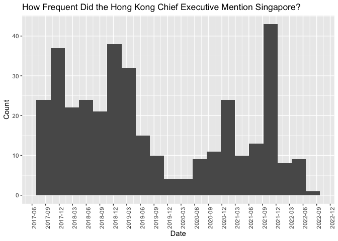

Lab: Basic String Operations
================
Haohan Chen (HKU)
2023-03-27

## Introduction

This notebook demonstrates basic string operations. I will use two
datasets as examples: the index table that we just obtained together and
the full set of documents that I have retrieved and parsed using the
methods I have introduced.

``` r
library(tidyverse)
```

    ## ── Attaching packages ─────────────────────────────────────── tidyverse 1.3.1 ──

    ## ✔ ggplot2 3.3.6     ✔ purrr   1.0.1
    ## ✔ tibble  3.1.8     ✔ dplyr   1.1.0
    ## ✔ tidyr   1.3.0     ✔ stringr 1.5.0
    ## ✔ readr   2.1.2     ✔ forcats 0.5.1

    ## ── Conflicts ────────────────────────────────────────── tidyverse_conflicts() ──
    ## ✖ dplyr::filter() masks stats::filter()
    ## ✖ dplyr::lag()    masks stats::lag()

``` r
library(lubridate)
```

    ## 
    ## Attaching package: 'lubridate'

    ## The following objects are masked from 'package:base':
    ## 
    ##     date, intersect, setdiff, union

``` r
# Index table
d_index = read_csv("data/_index_table.csv")
```

    ## Rows: 359 Columns: 3
    ## ── Column specification ────────────────────────────────────────────────────────
    ## Delimiter: ","
    ## chr (3): date, title, url
    ## 
    ## ℹ Use `spec()` to retrieve the full column specification for this data.
    ## ℹ Specify the column types or set `show_col_types = FALSE` to quiet this message.

``` r
# Full text
d_fulltext = read_rds("data/fulltext.rds")
```

## Detect Patterns of Interest I

``` r
# Distinguish articles from speeches
d_index_2 = d_index %>%
  mutate(
    speech = str_detect(title, "Speech"),
    article = str_detect(title, "Article"),
    .after = "date"
  )

# Any speech yet to be recognized?
d_index_2 %>%
  filter(speech == FALSE & article == FALSE)
```

    ## # A tibble: 42 × 5
    ##    date      speech article title                                          url  
    ##    <chr>     <lgl>  <lgl>   <chr>                                          <chr>
    ##  1 6.10.2021 FALSE  FALSE   "CE's speech in delivering \"The Chief Execut… http…
    ##  2 6.10.2021 FALSE  FALSE   "CE's speech in delivering \"The Chief Execut… http…
    ##  3 6.10.2021 FALSE  FALSE   "CE's speech in delivering \"The Chief Execut… http…
    ##  4 6.10.2021 FALSE  FALSE   "CE's speech in delivering \"The Chief Execut… http…
    ##  5 6.10.2021 FALSE  FALSE   "CE's speech in delivering \"The Chief Execut… http…
    ##  6 6.10.2021 FALSE  FALSE   "CE's speech in delivering \"The Chief Execut… http…
    ##  7 6.10.2021 FALSE  FALSE   "CE's speech in delivering \"The Chief Execut… http…
    ##  8 6.10.2021 FALSE  FALSE   "CE's speech in delivering \"The Chief Execut… http…
    ##  9 6.10.2021 FALSE  FALSE   "CE's speech in delivering \"The Chief Execut… http…
    ## 10 6.10.2021 FALSE  FALSE   "CE's speech in delivering \"The Chief Execut… http…
    ## # … with 32 more rows

``` r
# Revise the rules
d_index_2 = d_index %>%
  mutate(
    speech = str_detect(title, "(S|s)peech"),
    article = str_detect(title, "Article"),
    .after = "date"
  )

# Check again
d_index_2 %>%
  filter(speech == FALSE & article == FALSE)
```

    ## # A tibble: 9 × 5
    ##   date       speech article title                                          url  
    ##   <chr>      <lgl>  <lgl>   <chr>                                          <chr>
    ## 1 15.7.2021  FALSE  FALSE   Opening remarks by the Chief Executive at the… pdf/…
    ## 2 11.2.2021  FALSE  FALSE   New year message from the Chief Executive to … spee…
    ## 3 8.12.2020  FALSE  FALSE   CE speaks at Asian Insurance Forum 2020        http…
    ## 4 30.6.2020  FALSE  FALSE   Video message by CE at United Nations Human R… http…
    ## 5 29.5.2020  FALSE  FALSE   CE's letter to Hong Kong citizens              pdf/…
    ## 6 29.11.2019 FALSE  FALSE   Opening remarks by CE at press conference in … http…
    ## 7 25.10.2019 FALSE  FALSE   Eulogy by CE at funeral service of Sir David … http…
    ## 8 14.11.2018 FALSE  FALSE   Transcript of remarks by CE at question-and-a… http…
    ## 9 31.10.2017 FALSE  FALSE   Transcript of remarks by CE at question-and-a… http…

``` r
# Revise the rules
d_index_2 = d_index %>%
  mutate(
    speech = str_detect(title, "((S|s)peech|remarks|message|speak)"),
    article = str_detect(title, "(Article|letter)"),
    .after = "date"
  )

# And check again
d_index_2 %>%
  filter(speech == FALSE & article == FALSE)
```

    ## # A tibble: 1 × 5
    ##   date       speech article title                                          url  
    ##   <chr>      <lgl>  <lgl>   <chr>                                          <chr>
    ## 1 25.10.2019 FALSE  FALSE   Eulogy by CE at funeral service of Sir David … http…

``` r
# Revise the rules
d_index_2 = d_index %>%
  mutate(
    speech = str_detect(title, "((S|s)peech|remarks|message|speak)"),
    article = str_detect(title, "(Article|letter|Eulogy)"),
    .after = "date"
  )

# And check again
d_index_2 %>%
  filter(speech == FALSE & article == FALSE)
```

    ## # A tibble: 0 × 5
    ## # … with 5 variables: date <chr>, speech <lgl>, article <lgl>, title <chr>,
    ## #   url <chr>

``` r
d_index_2 %>%
  filter(speech == TRUE & article == TRUE)
```

    ## # A tibble: 0 × 5
    ## # … with 5 variables: date <chr>, speech <lgl>, article <lgl>, title <chr>,
    ## #   url <chr>

## Detect Patterns of Interest II

When and how did the Hong Kong Chief Executive talk about Singapore?

``` r
# Check: When Mentioning Singapore in the main text
d_fulltext_s_sin = d_fulltext %>% filter(str_detect(text, "Singapor"))

str_locate_all(d_fulltext_s_sin$text[1], "Singapor") 
```

    ## [[1]]
    ##      start  end
    ## [1,]  4565 4572

``` r
# Loate the mentioning in the first document and see the context
str_locate_all(d_fulltext_s_sin$text[1], "Singapor") 
```

    ## [[1]]
    ##      start  end
    ## [1,]  4565 4572

``` r
str_sub(d_fulltext_s_sin$text[1], 4565-200, 4572+200)
```

    ## [1] "the UK,\nColombia, Korea and Indonesia, having regard to their epidemic\nsituation. We have also enhanced the testing arrangements for\npersons arriving in Hong Kong from the Mainland, Macao,\nTaiwan and Singapore.\n      The major measures introduced are set out below\nchronologically:\n Date       Event\n May 25     The Government announced the extension of the\n            COVID-19 Vaccination Programme to Main"

``` r
# Locate the mentioning in the second document and see the context
str_locate_all(d_fulltext_s_sin$text[2], "Singapor") 
```

    ## [[1]]
    ##      start  end
    ## [1,]  2517 2524
    ## [2,]  6080 6087
    ## [3,]  6131 6138
    ## [4,]  6880 6887

``` r
# Count the number of time a pattern is mentioned in a text piece
str_count(d_fulltext_s_sin$text[2], "Singapor") 
```

    ## [1] 4

``` r
str_sub(d_fulltext_s_sin$text[2], 2517-200, 2524+200)
```

    ## [1] "y\nrestrictions and quarantine requirements for incoming travellers from\nplaces including India, Pakistan, the Philippines, Nepal, Taiwan,\nArgentina, Italy, Japan, Kenya, Malaysia, the Netherlands and\nSingapore. On the prevention of the spreading of the virus in the\ncommunity, in addition to the comprehensive and thorough\ninvestigation of each local confirmed case including conducting gene\nsequencing tests"

``` r
# Looks like many are related to Covid-19 measures.
```

``` r
d_fulltext %>%
  mutate(date_of_speech = dmy(date_of_speech)) %>%
  ggplot() +
  geom_histogram(aes(x = date_of_speech), bins =  20) +
  scale_x_date(date_breaks = "3 months", date_labels = "%Y-%m") +
  theme(axis.text.x = element_text(angle = 90)) +
  xlab("Date") + ylab("Count") +
  labs(title = "How Frequent Did the Hong Kong Chief Executive Mention Singapore?")
```



## More text operation of this kind?

Check out the `stringr` R package, a part of the `tidyverse` toolkit:
<https://stringr.tidyverse.org/>
