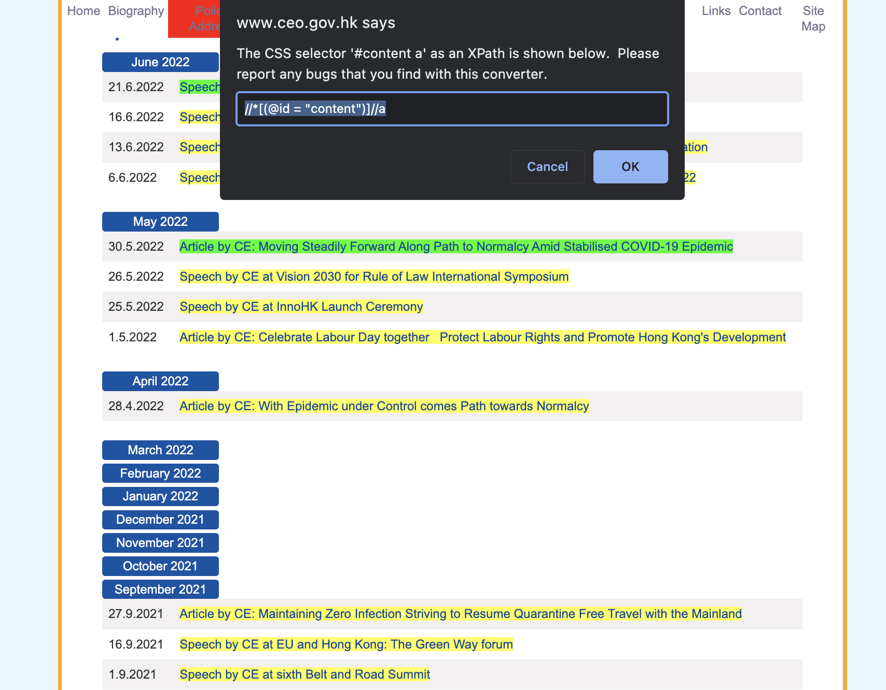
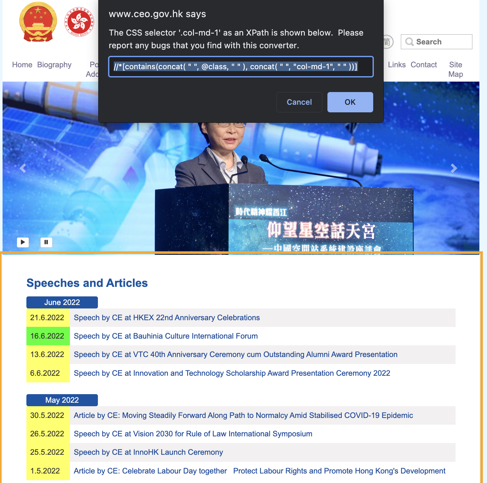

Lab: Text Data Collection (II)
================
Haohan Chen (HKU)
2023-03-27

## Introduction

This notebook demonstrate the basics of web scraping.

``` r
library(tidyverse)
```

    ## ── Attaching packages ─────────────────────────────────────── tidyverse 1.3.1 ──

    ## ✔ ggplot2 3.3.6     ✔ purrr   1.0.1
    ## ✔ tibble  3.1.8     ✔ dplyr   1.1.0
    ## ✔ tidyr   1.3.0     ✔ stringr 1.5.0
    ## ✔ readr   2.1.2     ✔ forcats 0.5.1

    ## ── Conflicts ────────────────────────────────────────── tidyverse_conflicts() ──
    ## ✖ dplyr::filter() masks stats::filter()
    ## ✖ dplyr::lag()    masks stats::lag()

## Retrieving a HTML webpage

``` r
library(xml2)

retrieved_html = read_html("https://www.info.gov.hk/gia/general/202206/21/P2022062100598.htm")
write_html(retrieved_html, "data/retrieve_sample.html")
```

## Retrieving a File (e.g., a PDF document)

``` r
download.file(
  url = "https://www.ceo.gov.hk/archive/5-term/eng/pdf/article20220530.pdf",
  destfile = "data/retrieve_sample.pdf")
```

## Indexing

The first step of indexing is locating a “hub” where you have the links
to all your documents of interest. The task is easier for some websites
but harder for some others. We look at a “easier” case:
<https://www.ceo.gov.hk/archive/5-term/eng/speech.html>

``` r
retrieved_index = read_html("https://www.ceo.gov.hk/archive/5-term/eng/speech.html")

# Again, Use SelectorGadget to identify links
retrieved_index_links = retrieved_index %>%
  xml_find_all('//*[(@id = "content")]//a')
```



``` r
print(retrieved_index_links[1])
```

    ## {xml_nodeset (1)}
    ## [1] <a href="https://www.info.gov.hk/gia/general/202206/21/P2022062100598.htm ...

``` r
parsed_url = retrieved_index_links %>% xml_attr("href") # Get links. 
parsed_titles = retrieved_index_links %>% xml_text() # Get titles
```

``` r
# Asides, get dates of speeches
retrieved_index_dates = retrieved_index %>% 
  xml_find_all('//*[contains(concat( " ", @class, " " ), concat( " ", "col-md-1", " " ))]')
parsed_dates = retrieved_index_dates %>% xml_text()
```

``` r
# Finally, we can build an "Index Table"
table_index = tibble(
  date = parsed_dates,
  title = parsed_titles,
  url = parsed_url
)
```

``` r
# Save the index table
write_csv(table_index, "data/_index_table.csv")
```


