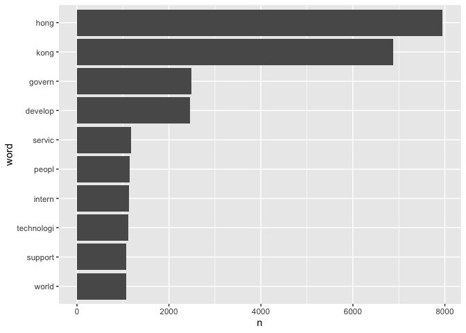
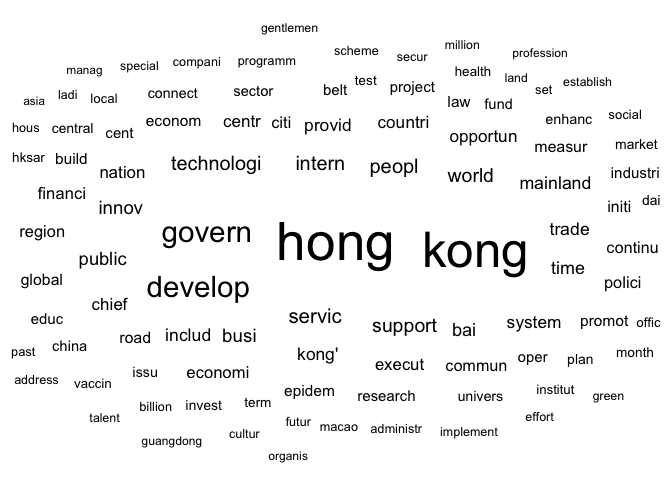
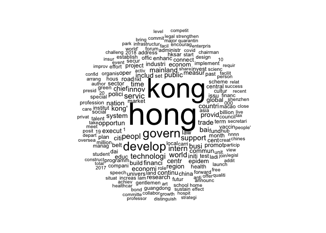
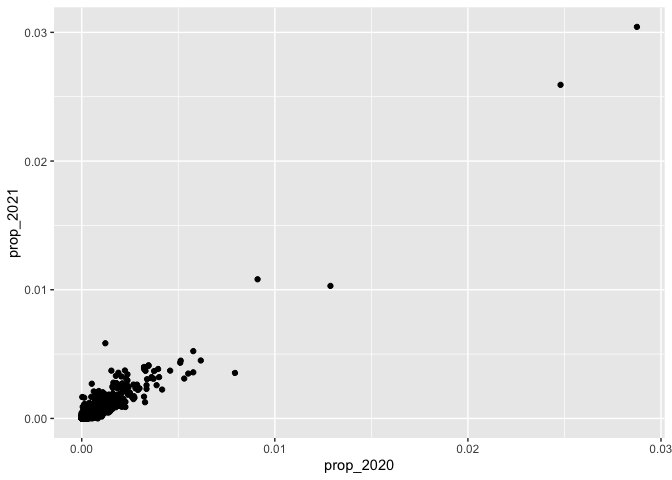
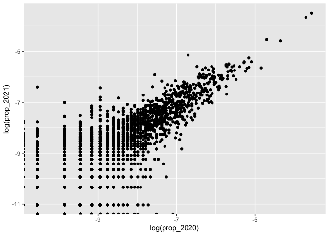
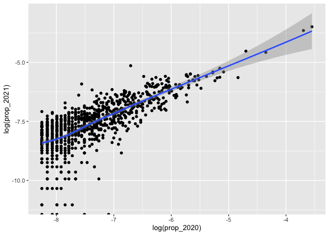
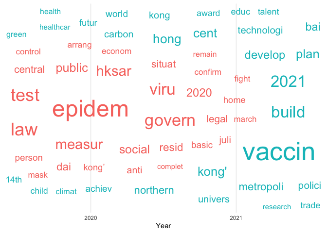

Lab: Tokenization, Wrangling, EDA
================
Haohan Chen (HKU)
2023-03-27

## Introduction

This notebook demonstrate tokenization, basic text wrangling, and
exploratory data analysis.

``` r
library(tidyverse)
```

    ## ── Attaching packages ─────────────────────────────────────── tidyverse 1.3.1 ──

    ## ✔ ggplot2 3.3.6     ✔ purrr   1.0.1
    ## ✔ tibble  3.1.8     ✔ dplyr   1.1.0
    ## ✔ tidyr   1.3.0     ✔ stringr 1.5.0
    ## ✔ readr   2.1.2     ✔ forcats 0.5.1

    ## ── Conflicts ────────────────────────────────────────── tidyverse_conflicts() ──
    ## ✖ dplyr::filter() masks stats::filter()
    ## ✖ dplyr::lag()    masks stats::lag()

``` r
library(lubridate)
```

    ## 
    ## Attaching package: 'lubridate'

    ## The following objects are masked from 'package:base':
    ## 
    ##     date, intersect, setdiff, union

``` r
d_fulltext = read_rds("data/fulltext.rds")
# Change the date variable to "date" format
d_fulltext = d_fulltext %>% mutate(date_of_speech = dmy(date_of_speech))
```

## Tokenization

``` r
if (!require("tidytext")) install.packages("tidytext")
```

    ## Loading required package: tidytext

``` r
library(tidytext) # Full introduction: http://tidytextmining.com/
```

``` r
d_tokenized = d_fulltext %>%
  select(uid, date_of_speech, text) %>%
  unnest_tokens(word, text)

head(d_tokenized, 20)
```

    ## # A tibble: 20 × 3
    ##    uid   date_of_speech word      
    ##    <chr> <date>         <chr>     
    ##  1 A1    2022-05-30     moving    
    ##  2 A1    2022-05-30     steadily  
    ##  3 A1    2022-05-30     forward   
    ##  4 A1    2022-05-30     along     
    ##  5 A1    2022-05-30     path      
    ##  6 A1    2022-05-30     to        
    ##  7 A1    2022-05-30     normalcy  
    ##  8 A1    2022-05-30     amid      
    ##  9 A1    2022-05-30     stabilised
    ## 10 A1    2022-05-30     covid     
    ## 11 A1    2022-05-30     19        
    ## 12 A1    2022-05-30     epidemic  
    ## 13 A1    2022-05-30     having    
    ## 14 A1    2022-05-30     gone      
    ## 15 A1    2022-05-30     through   
    ## 16 A1    2022-05-30     the       
    ## 17 A1    2022-05-30     turbulent 
    ## 18 A1    2022-05-30     time      
    ## 19 A1    2022-05-30     in        
    ## 20 A1    2022-05-30     early

``` r
# Simple?
```

## Wrangling: Remove Stop Words

``` r
# Load Stopwords
data("stop_words")

head(stop_words, 20)
```

    ## # A tibble: 20 × 2
    ##    word        lexicon
    ##    <chr>       <chr>  
    ##  1 a           SMART  
    ##  2 a's         SMART  
    ##  3 able        SMART  
    ##  4 about       SMART  
    ##  5 above       SMART  
    ##  6 according   SMART  
    ##  7 accordingly SMART  
    ##  8 across      SMART  
    ##  9 actually    SMART  
    ## 10 after       SMART  
    ## 11 afterwards  SMART  
    ## 12 again       SMART  
    ## 13 against     SMART  
    ## 14 ain't       SMART  
    ## 15 all         SMART  
    ## 16 allow       SMART  
    ## 17 allows      SMART  
    ## 18 almost      SMART  
    ## 19 alone       SMART  
    ## 20 along       SMART

``` r
# Remove stopwords
d_tokenized_s = d_tokenized %>%
  anti_join(stop_words, by = "word")
# anti_join: whatever appearing in the stop_words dataframe, we remove it.
```

## Wrangling \[Optional\]: Stemming

``` r
if (!require(SnowballC)) install.packages("SnowballC")
```

    ## Loading required package: SnowballC

``` r
library(SnowballC)
```

``` r
d_tokenized_s = d_tokenized_s %>%
  mutate(stem = wordStem(word))

head(d_tokenized_s, 20)
```

    ## # A tibble: 20 × 4
    ##    uid   date_of_speech word       stem    
    ##    <chr> <date>         <chr>      <chr>   
    ##  1 A1    2022-05-30     moving     move    
    ##  2 A1    2022-05-30     steadily   steadili
    ##  3 A1    2022-05-30     forward    forward 
    ##  4 A1    2022-05-30     path       path    
    ##  5 A1    2022-05-30     normalcy   normalci
    ##  6 A1    2022-05-30     amid       amid    
    ##  7 A1    2022-05-30     stabilised stabilis
    ##  8 A1    2022-05-30     covid      covid   
    ##  9 A1    2022-05-30     19         19      
    ## 10 A1    2022-05-30     epidemic   epidem  
    ## 11 A1    2022-05-30     turbulent  turbul  
    ## 12 A1    2022-05-30     time       time    
    ## 13 A1    2022-05-30     march      march   
    ## 14 A1    2022-05-30     arrival    arriv   
    ## 15 A1    2022-05-30     dawn       dawn    
    ## 16 A1    2022-05-30     april      april   
    ## 17 A1    2022-05-30     wave       wave    
    ## 18 A1    2022-05-30     epidemic   epidem  
    ## 19 A1    2022-05-30     control    control 
    ## 20 A1    2022-05-30     daily      daili

## Exploratory Data Analysis

### Count word frequencies

``` r
# Count term frequencies (for raw words)
word_frequency = d_tokenized_s %>%
  count(word, sort = TRUE)

head(word_frequency, 20)
```

    ## # A tibble: 20 × 2
    ##    word              n
    ##    <chr>         <int>
    ##  1 hong           7952
    ##  2 kong           6879
    ##  3 government     2274
    ##  4 development    1916
    ##  5 people         1126
    ##  6 international  1107
    ##  7 world          1066
    ##  8 technology     1043
    ##  9 bay             934
    ## 10 public          914
    ## 11 mainland        888
    ## 12 services        886
    ## 13 kong's          859
    ## 14 support         843
    ## 15 business        816
    ## 16 chief           803
    ## 17 innovation      795
    ## 18 financial       778
    ## 19 executive       773
    ## 20 trade           710

``` r
# Count term frequencies (for Stemmed word -- recommended)
word_frequency = d_tokenized_s %>%
  count(stem, sort = TRUE) %>%
  rename("word" = "stem")

head(word_frequency, 20)
```

    ## # A tibble: 20 × 2
    ##    word           n
    ##    <chr>      <int>
    ##  1 hong        7952
    ##  2 kong        6879
    ##  3 govern      2488
    ##  4 develop     2461
    ##  5 servic      1184
    ##  6 peopl       1142
    ##  7 intern      1124
    ##  8 technologi  1117
    ##  9 support     1069
    ## 10 world       1067
    ## 11 innov        987
    ## 12 busi         985
    ## 13 public       952
    ## 14 bai          934
    ## 15 time         905
    ## 16 mainland     888
    ## 17 trade        876
    ## 18 includ       874
    ## 19 kong'        859
    ## 20 provid       853

### Examine most popular words

``` r
# Get a subset of most frequent words
word_frequency_top = word_frequency %>%
  arrange(desc(n)) %>% # Make sure that it is sorted properly
  slice(1:200) # Take the first 200 rows. 
```

### Plot most popular words

``` r
word_frequency_top %>%
  slice(1:10) %>%
  mutate(word = reorder(word, n)) %>%
  ggplot(aes(x = n, y = word)) +
  geom_col()
```

<!-- -->

### Plot a Word Cloud

``` r
if (!require(ggwordcloud)) install.packages("ggwordcloud")
```

    ## Loading required package: ggwordcloud

``` r
library(ggwordcloud)

word_frequency_top %>%
  slice(1:100) %>%
  ggplot(aes(label = word, size = n)) +
  scale_size_area(max_size = 14) +
  geom_text_wordcloud() +
  theme_minimal()
```

<!-- -->

``` r
# An alternative wordcloud package
if (!require(wordcloud)) install.packages("wordcloud")
```

    ## Loading required package: wordcloud

    ## Loading required package: RColorBrewer

``` r
library(wordcloud)

wordcloud(
  word_frequency_top$word, word_frequency_top$n, 
  rot.per = 0, random.order = FALSE, random.color = TRUE)
```

<!-- -->

``` r
# The third wordcloud package
# https://r-graph-gallery.com/196-the-wordcloud2-library.html
if (!require(wordcloud2)) install.packages("wordcloud2")
```

    ## Loading required package: wordcloud2

``` r
word_frequency_top %>%
  wordcloud2(.)
```

    ## PhantomJS not found. You can install it with webshot::install_phantomjs(). If it is installed, please make sure the phantomjs executable can be found via the PATH variable.

<div id="htmlwidget-4669a54af6ae9809d189" style="width:672px;height:480px;" class="wordcloud2 html-widget"></div>
<script type="application/json" data-for="htmlwidget-4669a54af6ae9809d189">{"x":{"word":["hong","kong","govern","develop","servic","peopl","intern","technologi","support","world","innov","busi","public","bai","time","mainland","trade","includ","kong'","provid","system","opportun","countri","centr","nation","chief","execut","financi","economi","region","polici","citi","continu","commun","initi","global","measur","road","econom","epidem","promot","build","law","industri","project","belt","educ","research","cent","oper","sector","china","fund","issu","connect","enhanc","univers","central","plan","dai","market","invest","month","test","term","health","hksar","vaccin","offic","local","institut","social","set","programm","billion","macao","scheme","past","administr","hous","compani","secur","futur","ladi","address","cultur","implement","establish","effort","special","green","million","talent","gentlemen","land","guangdong","organis","profession","asia","manag","carri","council","financ","19","student","hub","unit","increas","school","role","start","forum","forward","000","speech","lam","scienc","sustain","meet","announc","design","launch","encourag","creat","person","major","event","author","hkt","infrastructur","nnnn","offer","achiev","join","home","take","2018","secretari","chairman","free","world'","art","posit","commit","activ","arrang","collabor","shenzhen","success","oversea","particip","chines","anti","growth","presid","live","facil","view","1","healthcar","insur","20","hospit","share","covid","people'","challeng","bond","close","depart","legisl","quarantin","care","enterpris","bring","construct","improv","facilit","addit","recent","requir","privat","2017","committe","situat","qualiti","10","park","effect","professor","total","distinguish","strengthen","tax","relat","legal","competit","level","confid","strategi"],"freq":[7952,6879,2488,2461,1184,1142,1124,1117,1069,1067,987,985,952,934,905,888,876,874,859,853,844,832,831,823,810,804,790,782,780,770,761,749,739,733,720,709,709,707,686,677,677,669,668,645,640,638,636,634,626,622,611,609,599,582,579,573,565,553,553,552,552,550,523,520,517,511,511,500,499,489,483,480,471,462,461,460,460,459,457,455,453,451,450,446,442,442,442,434,433,431,430,430,430,424,424,416,411,405,399,396,395,392,391,387,385,381,378,377,376,371,371,369,369,358,357,351,351,345,344,343,342,342,340,337,337,334,332,326,325,324,324,323,322,321,319,319,314,314,312,311,309,308,308,307,305,305,305,305,302,301,301,297,295,294,293,292,287,286,285,285,285,284,284,284,283,283,282,281,281,280,280,280,277,277,275,275,274,272,271,270,269,268,266,264,264,263,259,259,257,257,256,255,255,254,252,251,250,250,247,246],"fontFamily":"Segoe UI","fontWeight":"bold","color":"random-dark","minSize":0,"weightFactor":0.022635814889336,"backgroundColor":"white","gridSize":0,"minRotation":-0.785398163397448,"maxRotation":0.785398163397448,"shuffle":true,"rotateRatio":0.4,"shape":"circle","ellipticity":0.65,"figBase64":null,"hover":null},"evals":[],"jsHooks":{"render":[{"code":"function(el,x){\n                        console.log(123);\n                        if(!iii){\n                          window.location.reload();\n                          iii = False;\n\n                        }\n  }","data":null}]}}</script>

``` r
word_frequency_top %>%
  wordcloud2(., shape = "star")
```

<div id="htmlwidget-91a77c99094177b3cd6f" style="width:672px;height:480px;" class="wordcloud2 html-widget"></div>
<script type="application/json" data-for="htmlwidget-91a77c99094177b3cd6f">{"x":{"word":["hong","kong","govern","develop","servic","peopl","intern","technologi","support","world","innov","busi","public","bai","time","mainland","trade","includ","kong'","provid","system","opportun","countri","centr","nation","chief","execut","financi","economi","region","polici","citi","continu","commun","initi","global","measur","road","econom","epidem","promot","build","law","industri","project","belt","educ","research","cent","oper","sector","china","fund","issu","connect","enhanc","univers","central","plan","dai","market","invest","month","test","term","health","hksar","vaccin","offic","local","institut","social","set","programm","billion","macao","scheme","past","administr","hous","compani","secur","futur","ladi","address","cultur","implement","establish","effort","special","green","million","talent","gentlemen","land","guangdong","organis","profession","asia","manag","carri","council","financ","19","student","hub","unit","increas","school","role","start","forum","forward","000","speech","lam","scienc","sustain","meet","announc","design","launch","encourag","creat","person","major","event","author","hkt","infrastructur","nnnn","offer","achiev","join","home","take","2018","secretari","chairman","free","world'","art","posit","commit","activ","arrang","collabor","shenzhen","success","oversea","particip","chines","anti","growth","presid","live","facil","view","1","healthcar","insur","20","hospit","share","covid","people'","challeng","bond","close","depart","legisl","quarantin","care","enterpris","bring","construct","improv","facilit","addit","recent","requir","privat","2017","committe","situat","qualiti","10","park","effect","professor","total","distinguish","strengthen","tax","relat","legal","competit","level","confid","strategi"],"freq":[7952,6879,2488,2461,1184,1142,1124,1117,1069,1067,987,985,952,934,905,888,876,874,859,853,844,832,831,823,810,804,790,782,780,770,761,749,739,733,720,709,709,707,686,677,677,669,668,645,640,638,636,634,626,622,611,609,599,582,579,573,565,553,553,552,552,550,523,520,517,511,511,500,499,489,483,480,471,462,461,460,460,459,457,455,453,451,450,446,442,442,442,434,433,431,430,430,430,424,424,416,411,405,399,396,395,392,391,387,385,381,378,377,376,371,371,369,369,358,357,351,351,345,344,343,342,342,340,337,337,334,332,326,325,324,324,323,322,321,319,319,314,314,312,311,309,308,308,307,305,305,305,305,302,301,301,297,295,294,293,292,287,286,285,285,285,284,284,284,283,283,282,281,281,280,280,280,277,277,275,275,274,272,271,270,269,268,266,264,264,263,259,259,257,257,256,255,255,254,252,251,250,250,247,246],"fontFamily":"Segoe UI","fontWeight":"bold","color":"random-dark","minSize":0,"weightFactor":0.022635814889336,"backgroundColor":"white","gridSize":0,"minRotation":-0.785398163397448,"maxRotation":0.785398163397448,"shuffle":true,"rotateRatio":0.4,"shape":"star","ellipticity":0.65,"figBase64":null,"hover":null},"evals":[],"jsHooks":{"render":[{"code":"function(el,x){\n                        console.log(123);\n                        if(!iii){\n                          window.location.reload();\n                          iii = False;\n\n                        }\n  }","data":null}]}}</script>

``` r
word_frequency_top %>%
  wordcloud2(., shape = "pentagon")
```

<div id="htmlwidget-257bd08bd43e9ca0bc64" style="width:672px;height:480px;" class="wordcloud2 html-widget"></div>
<script type="application/json" data-for="htmlwidget-257bd08bd43e9ca0bc64">{"x":{"word":["hong","kong","govern","develop","servic","peopl","intern","technologi","support","world","innov","busi","public","bai","time","mainland","trade","includ","kong'","provid","system","opportun","countri","centr","nation","chief","execut","financi","economi","region","polici","citi","continu","commun","initi","global","measur","road","econom","epidem","promot","build","law","industri","project","belt","educ","research","cent","oper","sector","china","fund","issu","connect","enhanc","univers","central","plan","dai","market","invest","month","test","term","health","hksar","vaccin","offic","local","institut","social","set","programm","billion","macao","scheme","past","administr","hous","compani","secur","futur","ladi","address","cultur","implement","establish","effort","special","green","million","talent","gentlemen","land","guangdong","organis","profession","asia","manag","carri","council","financ","19","student","hub","unit","increas","school","role","start","forum","forward","000","speech","lam","scienc","sustain","meet","announc","design","launch","encourag","creat","person","major","event","author","hkt","infrastructur","nnnn","offer","achiev","join","home","take","2018","secretari","chairman","free","world'","art","posit","commit","activ","arrang","collabor","shenzhen","success","oversea","particip","chines","anti","growth","presid","live","facil","view","1","healthcar","insur","20","hospit","share","covid","people'","challeng","bond","close","depart","legisl","quarantin","care","enterpris","bring","construct","improv","facilit","addit","recent","requir","privat","2017","committe","situat","qualiti","10","park","effect","professor","total","distinguish","strengthen","tax","relat","legal","competit","level","confid","strategi"],"freq":[7952,6879,2488,2461,1184,1142,1124,1117,1069,1067,987,985,952,934,905,888,876,874,859,853,844,832,831,823,810,804,790,782,780,770,761,749,739,733,720,709,709,707,686,677,677,669,668,645,640,638,636,634,626,622,611,609,599,582,579,573,565,553,553,552,552,550,523,520,517,511,511,500,499,489,483,480,471,462,461,460,460,459,457,455,453,451,450,446,442,442,442,434,433,431,430,430,430,424,424,416,411,405,399,396,395,392,391,387,385,381,378,377,376,371,371,369,369,358,357,351,351,345,344,343,342,342,340,337,337,334,332,326,325,324,324,323,322,321,319,319,314,314,312,311,309,308,308,307,305,305,305,305,302,301,301,297,295,294,293,292,287,286,285,285,285,284,284,284,283,283,282,281,281,280,280,280,277,277,275,275,274,272,271,270,269,268,266,264,264,263,259,259,257,257,256,255,255,254,252,251,250,250,247,246],"fontFamily":"Segoe UI","fontWeight":"bold","color":"random-dark","minSize":0,"weightFactor":0.022635814889336,"backgroundColor":"white","gridSize":0,"minRotation":-0.785398163397448,"maxRotation":0.785398163397448,"shuffle":true,"rotateRatio":0.4,"shape":"pentagon","ellipticity":0.65,"figBase64":null,"hover":null},"evals":[],"jsHooks":{"render":[{"code":"function(el,x){\n                        console.log(123);\n                        if(!iii){\n                          window.location.reload();\n                          iii = False;\n\n                        }\n  }","data":null}]}}</script>

## Comparative Exploratory Analysis

How does the focus differ between 2021 and 2020? Our final set of
analysis in this note focuses on a comparative analysis of word
frequencies.

``` r
# Calculate term frequencies for 2020 and 2021 respectively
word_frequency_compare_21_20 = d_tokenized_s %>%
  mutate(year = year(date_of_speech), .after = "date_of_speech") %>%
  filter(year == 2020 | year == 2021) %>%
  group_by(year, stem) %>%
  count(sort = TRUE) %>%
  pivot_wider(names_from = "year", values_from = "n", 
              names_prefix = "n_", values_fill = 0) %>%
  ungroup() %>%
  mutate(
    prop_2021 = n_2021 / sum(n_2021),
    prop_2020 = n_2020 / sum(n_2020)
  )
```

``` r
# Visualize the word frequencies in the two years
word_frequency_compare_21_20 %>%
  ggplot(aes(x = prop_2020, y = prop_2021)) +
  geom_point()
```

<!-- -->

``` r
word_frequency_compare_21_20 %>%
  ggplot(aes(x = log(prop_2020), y = log(prop_2021))) +
  geom_point()
```

<!-- -->

``` r
word_frequency_compare_21_20 %>%
  filter(n_2020 >= 10) %>%
  ggplot(aes(x = log(prop_2020), y = log(prop_2021))) +
  geom_point() +
  geom_smooth()
```

    ## `geom_smooth()` using method = 'loess' and formula 'y ~ x'

    ## Warning: Removed 5 rows containing non-finite values (stat_smooth).

<!-- -->

``` r
# The biggest difference?

## What words get mentioned more in 2021 compared to 2020?
tmp_plot_21 = word_frequency_compare_21_20 %>%
  mutate(diff = prop_2021 - prop_2020) %>%
  slice_min(diff, n = 30) %>%
  arrange(diff)
  
## What words get mentioned more in 2020 compared to 2021?
tmp_plot_20 = word_frequency_compare_21_20 %>%
  mutate(diff = prop_2021 - prop_2020) %>%
  slice_max(diff, n = 30) %>%
  arrange(desc(diff))
```

``` r
# Visualize the difference in a nice way?
set.seed(327)
tmp_plot_21 %>% 
  mutate(Year = "2020") %>%
  bind_rows(tmp_plot_20 %>% mutate(Year = "2021")) %>%
  ggplot(aes(label = stem, x = Year, color = Year, size = abs(diff))) +
  geom_text_wordcloud_area() +
  scale_size_area(max_size = 14) +
  theme_minimal() +
  theme(legend.position = "top")
```

    ## Warning in wordcloud_boxes(data_points = points_valid_first, boxes = boxes, :
    ## One word could not fit on page. It has been placed at its original position.

<!-- -->
