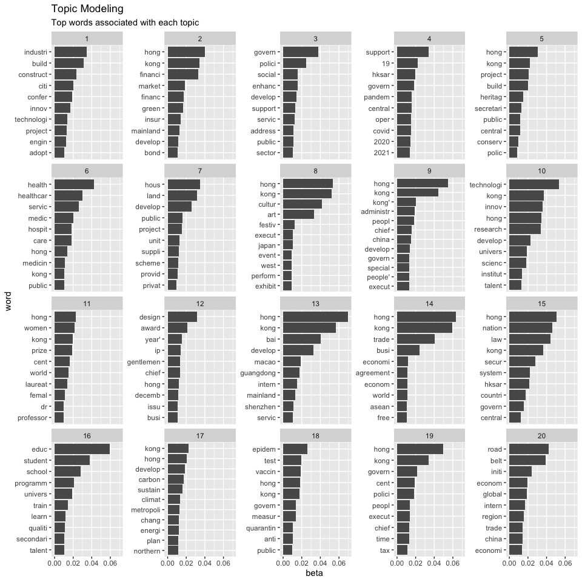
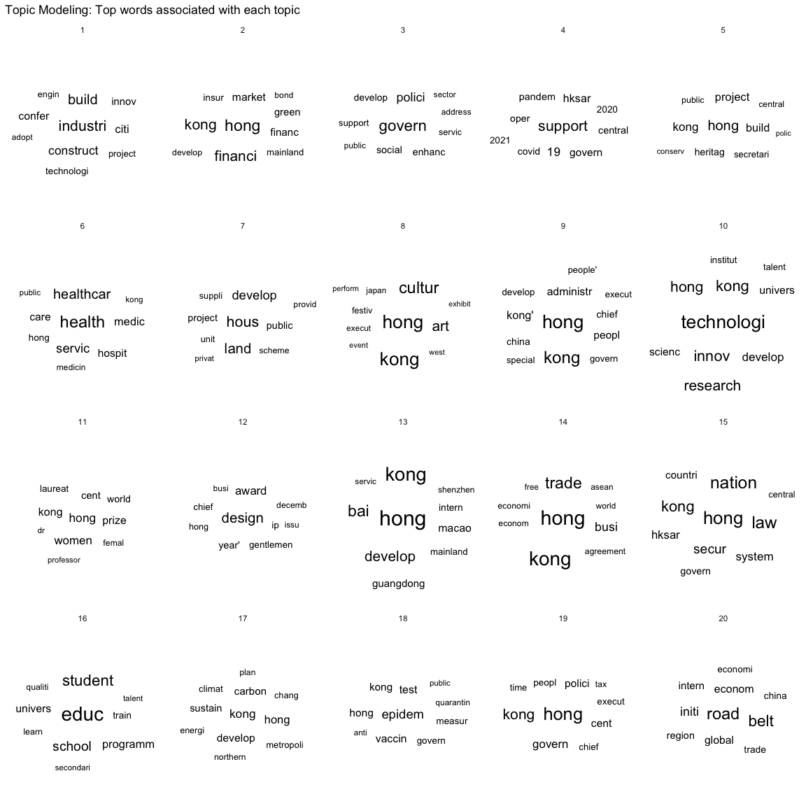

Lab: Topic Modeling
================
Haohan Chen (HKU)
2023-03-27

## Introduction

This notebook demonstrate Topic Modeling

``` r
library(tidyverse)
```

    ## ── Attaching packages ─────────────────────────────────────── tidyverse 1.3.1 ──

    ## ✔ ggplot2 3.3.6     ✔ purrr   1.0.1
    ## ✔ tibble  3.1.8     ✔ dplyr   1.1.0
    ## ✔ tidyr   1.3.0     ✔ stringr 1.5.0
    ## ✔ readr   2.1.2     ✔ forcats 0.5.1

    ## ── Conflicts ────────────────────────────────────────── tidyverse_conflicts() ──
    ## ✖ dplyr::filter() masks stats::filter()
    ## ✖ dplyr::lag()    masks stats::lag()

``` r
library(lubridate)
```

    ## 
    ## Attaching package: 'lubridate'

    ## The following objects are masked from 'package:base':
    ## 
    ##     date, intersect, setdiff, union

``` r
d_fulltext = read_rds("data/fulltext.rds")
# Change the date variable to "date" format
d_fulltext = d_fulltext %>% mutate(date_of_speech = dmy(date_of_speech))
```

## Tokenization

``` r
if (!require("tidytext")) install.packages("tidytext")
```

    ## Loading required package: tidytext

``` r
library(tidytext) # Full introduction: http://tidytextmining.com/
```

``` r
d_tokenized = d_fulltext %>%
  select(uid, date_of_speech, text) %>%
  unnest_tokens(word, text)

head(d_tokenized, 20)
```

    ## # A tibble: 20 × 3
    ##    uid   date_of_speech word      
    ##    <chr> <date>         <chr>     
    ##  1 A1    2022-05-30     moving    
    ##  2 A1    2022-05-30     steadily  
    ##  3 A1    2022-05-30     forward   
    ##  4 A1    2022-05-30     along     
    ##  5 A1    2022-05-30     path      
    ##  6 A1    2022-05-30     to        
    ##  7 A1    2022-05-30     normalcy  
    ##  8 A1    2022-05-30     amid      
    ##  9 A1    2022-05-30     stabilised
    ## 10 A1    2022-05-30     covid     
    ## 11 A1    2022-05-30     19        
    ## 12 A1    2022-05-30     epidemic  
    ## 13 A1    2022-05-30     having    
    ## 14 A1    2022-05-30     gone      
    ## 15 A1    2022-05-30     through   
    ## 16 A1    2022-05-30     the       
    ## 17 A1    2022-05-30     turbulent 
    ## 18 A1    2022-05-30     time      
    ## 19 A1    2022-05-30     in        
    ## 20 A1    2022-05-30     early

``` r
# Simple?
```

## Wrangling: Remove Stop Words

``` r
# Load Stopwords
data("stop_words")

head(stop_words, 20)
```

    ## # A tibble: 20 × 2
    ##    word        lexicon
    ##    <chr>       <chr>  
    ##  1 a           SMART  
    ##  2 a's         SMART  
    ##  3 able        SMART  
    ##  4 about       SMART  
    ##  5 above       SMART  
    ##  6 according   SMART  
    ##  7 accordingly SMART  
    ##  8 across      SMART  
    ##  9 actually    SMART  
    ## 10 after       SMART  
    ## 11 afterwards  SMART  
    ## 12 again       SMART  
    ## 13 against     SMART  
    ## 14 ain't       SMART  
    ## 15 all         SMART  
    ## 16 allow       SMART  
    ## 17 allows      SMART  
    ## 18 almost      SMART  
    ## 19 alone       SMART  
    ## 20 along       SMART

``` r
# Remove stopwords
d_tokenized_s = d_tokenized %>%
  anti_join(stop_words, by = "word")
# anti_join: whatever appearing in the stop_words dataframe, we remove it.
```

## Wrangling \[Optional\]: Stemming

``` r
if (!require(SnowballC)) install.packages("SnowballC")
```

    ## Loading required package: SnowballC

``` r
library(SnowballC)
```

``` r
d_tokenized_s = d_tokenized_s %>%
  mutate(stem = wordStem(word))

head(d_tokenized_s, 20)
```

    ## # A tibble: 20 × 4
    ##    uid   date_of_speech word       stem    
    ##    <chr> <date>         <chr>      <chr>   
    ##  1 A1    2022-05-30     moving     move    
    ##  2 A1    2022-05-30     steadily   steadili
    ##  3 A1    2022-05-30     forward    forward 
    ##  4 A1    2022-05-30     path       path    
    ##  5 A1    2022-05-30     normalcy   normalci
    ##  6 A1    2022-05-30     amid       amid    
    ##  7 A1    2022-05-30     stabilised stabilis
    ##  8 A1    2022-05-30     covid      covid   
    ##  9 A1    2022-05-30     19         19      
    ## 10 A1    2022-05-30     epidemic   epidem  
    ## 11 A1    2022-05-30     turbulent  turbul  
    ## 12 A1    2022-05-30     time       time    
    ## 13 A1    2022-05-30     march      march   
    ## 14 A1    2022-05-30     arrival    arriv   
    ## 15 A1    2022-05-30     dawn       dawn    
    ## 16 A1    2022-05-30     april      april   
    ## 17 A1    2022-05-30     wave       wave    
    ## 18 A1    2022-05-30     epidemic   epidem  
    ## 19 A1    2022-05-30     control    control 
    ## 20 A1    2022-05-30     daily      daili

## Calculate Document-level Term Frequencies

``` r
d_word_frequencies = d_tokenized_s %>%
  group_by(uid, stem) %>%
  count()

head(d_word_frequencies)
```

    ## # A tibble: 6 × 3
    ## # Groups:   uid, stem [6]
    ##   uid   stem       n
    ##   <chr> <chr>  <int>
    ## 1 A1    0.4        1
    ## 2 A1    0.5        1
    ## 3 A1    000        6
    ## 4 A1    1          7
    ## 5 A1    1.66       1
    ## 6 A1    10,000     1

## Create Document-Term Matrix

``` r
dtm = d_word_frequencies %>% cast_dtm(uid, stem, n)
```

## Fit Topic Models

``` r
if (!require(topicmodels)) install.packages("topicmodels")
```

    ## Loading required package: topicmodels

``` r
library(topicmodels)

# Set number of topics
K = 20

# Set random number generator seed
set.seed(1122)

# compute the LDA model, inference via 1000 iterations of Gibbs sampling
m_tm = LDA(dtm, K, method="Gibbs", 
            control=list(iter = 500, verbose = 25))
```

    ## K = 20; V = 8903; M = 359
    ## Sampling 500 iterations!
    ## Iteration 25 ...
    ## Iteration 50 ...
    ## Iteration 75 ...
    ## Iteration 100 ...
    ## Iteration 125 ...
    ## Iteration 150 ...
    ## Iteration 175 ...
    ## Iteration 200 ...
    ## Iteration 225 ...
    ## Iteration 250 ...
    ## Iteration 275 ...
    ## Iteration 300 ...
    ## Iteration 325 ...
    ## Iteration 350 ...
    ## Iteration 375 ...
    ## Iteration 400 ...
    ## Iteration 425 ...
    ## Iteration 450 ...
    ## Iteration 475 ...
    ## Iteration 500 ...
    ## Gibbs sampling completed!

## Clean Results of Topic Models

``` r
## beta: How words map to topics
sum_tm_beta = tidy(m_tm, matrix = "beta")

## gamma: How documents map on topics
sum_tm_gamma = tidy(m_tm, matrix = "gamma") %>%
  rename("uid" = "document") 

sum_tm_gamma_wide = sum_tm_gamma %>%
  pivot_wider(names_from = "topic", values_from = "gamma", names_prefix = "topic_")
```

## Visualize Topic Modeling Results

``` r
sum_tm_gamma %>%
  group_by(topic) %>%
  summarise(sum_gamma = sum(gamma)) %>%
  arrange(desc(sum_gamma))
```

    ## # A tibble: 20 × 2
    ##    topic sum_gamma
    ##    <int>     <dbl>
    ##  1    18      26.5
    ##  2     2      24.4
    ##  3    10      24.2
    ##  4    13      23.8
    ##  5     9      23.6
    ##  6     3      21.7
    ##  7    20      21.4
    ##  8    14      21.3
    ##  9     8      20.0
    ## 10    15      18.0
    ## 11    19      17.5
    ## 12    12      16.5
    ## 13    16      15.6
    ## 14    11      15.0
    ## 15     7      12.4
    ## 16     4      12.1
    ## 17     6      12.1
    ## 18     1      11.2
    ## 19    17      10.9
    ## 20     5      10.9

``` r
TOP_N_WORD = 10

topic_top_word = sum_tm_beta %>%
  rename("word" = "term") %>%
  group_by(topic) %>%
  slice_max(beta, n = TOP_N_WORD) %>%
  arrange(topic, desc(beta))
```

``` r
### Visualization 1: Topics in bar charts

topic_top_word %>%
  mutate(word = reorder_within(word, beta, topic)) %>%
  ggplot(aes(y = word, x = beta)) +
  geom_bar(stat = "identity") +
  facet_wrap(~topic, scales = "free_y") +
  scale_y_reordered() + # Very interesting function. Use with reorder_within
  labs(
    title = "Topic Modeling",
    subtitle = "Top words associated with each topic"
  )
```

<!-- -->

``` r
### Visualization 2: Topics in word cloud
library(ggwordcloud)

topic_top_word %>%
  ggplot(aes(label = word, size = beta)) +
  geom_text_wordcloud() +
  scale_size_area(max_size = 8) + # Tune this number to change the scale
  facet_wrap(~factor(topic)) +
  labs(
   title = "Topic Modeling: Top words associated with each topic"
  ) +
  theme_minimal()
```

<!-- -->
